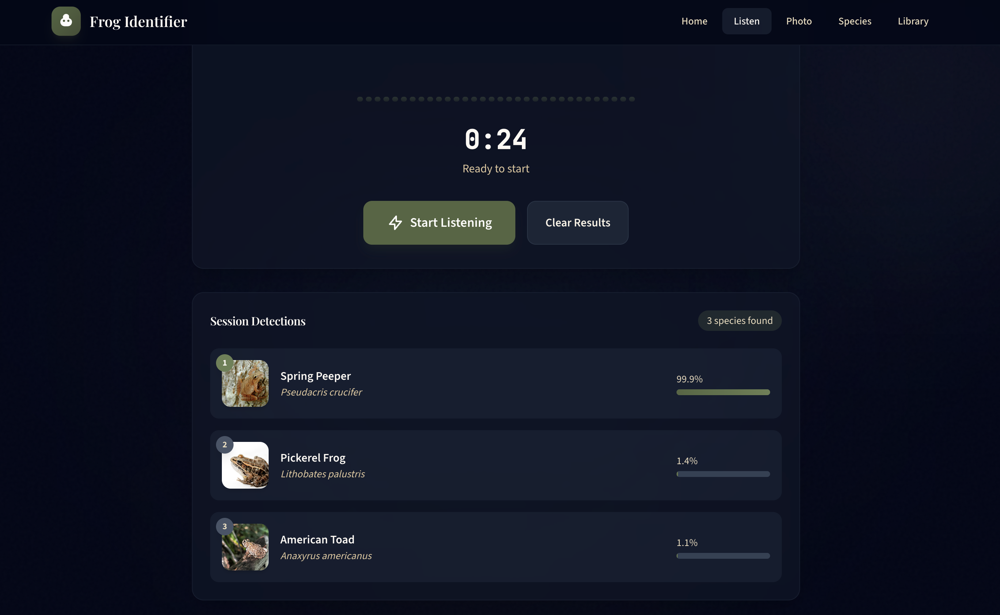
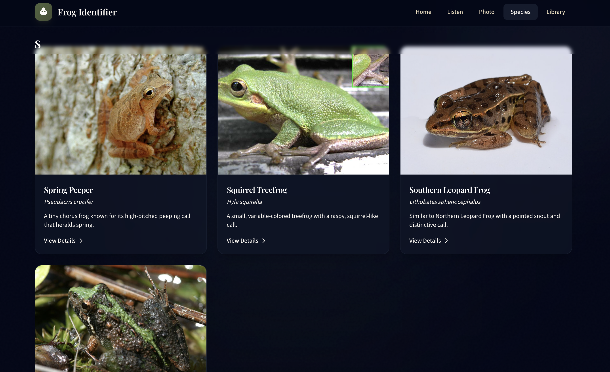

# Frog Identifier

A full-stack web application for identifying frog species by their calls and photos. Features real-time audio identification similar to Merlin Bird ID, photo-based species recognition, and a personal sighting library.


## Features

- **Real-time Audio Identification** - Continuous frog call detection using BirdNET, with live species updates every 3 seconds
- **Photo Recognition** - Upload frog photos for species identification using CLIP zero-shot classification
- **Personal Library** - Save and track your frog sightings with notes and location data
- **Species Guide** - Browse 27 frog and toad species with images and descriptions

## Screenshots

### Real-time Audio Identification


### Species Guide


## Tech Stack

**Backend**
- FastAPI with async SQLAlchemy 2.0
- MySQL 8.0 for data persistence
- BirdNET (Cornell Lab) for audio species identification
- HuggingFace CLIP for image classification
- WebSocket support for real-time audio streaming

**Frontend**
- Vue 3 with Composition API and TypeScript
- Pinia for state management
- Tailwind CSS for styling
- Web Audio API for microphone access

## Getting Started

### Prerequisites

- [Docker Desktop](https://www.docker.com/products/docker-desktop/)
- Git

### Setup

1. Clone the repository:

```bash
git clone https://github.com/yourusername/frog-identifier.git
cd frog-identifier
```

2. Start all services:

```bash
docker-compose up -d
```

3. Wait about 30-60 seconds for the ML models to load (check logs with `docker-compose logs -f backend`).

4. Open the app at http://localhost:5173

### Access Points

| Service | URL |
|---------|-----|
| Frontend | http://localhost:5173 |
| Backend API | http://localhost:8000 |
| API Docs | http://localhost:8000/docs |

## Development

The Docker setup supports hot-reload for both frontend and backend.

**Frontend changes**: Vite watches for file changes and updates automatically.

**Backend changes**: Uvicorn reloads when Python files change.

To view logs:

```bash
docker-compose logs -f          # All services
docker-compose logs -f backend  # Backend only
docker-compose logs -f frontend # Frontend only
```

To rebuild after dependency changes:

```bash
docker-compose down
docker-compose build --no-cache
docker-compose up -d
```

## Project Structure

```
frog-identifier/
├── backend/
│   ├── app/
│   │   ├── main.py          # FastAPI application
│   │   ├── config.py        # Settings
│   │   ├── database.py      # Database connection
│   │   ├── models/          # SQLAlchemy models
│   │   ├── schemas/         # Pydantic schemas
│   │   ├── routers/         # API endpoints
│   │   └── ml/              # ML classifiers
│   ├── migrations/          # Alembic migrations
│   └── uploads/             # Uploaded files and species images
├── frontend/
│   ├── src/
│   │   ├── components/      # Vue components
│   │   ├── views/           # Page components
│   │   ├── stores/          # Pinia stores
│   │   ├── services/        # API client
│   │   └── types/           # TypeScript types
│   └── package.json
└── docker-compose.yml
```

## API Endpoints

### Species
- `GET /api/v1/species` - List all species
- `GET /api/v1/species/{id}` - Get species details

### Sightings
- `GET /api/v1/sightings` - List sightings with optional filters
- `POST /api/v1/sightings` - Create a sighting
- `GET /api/v1/sightings/{id}` - Get sighting details
- `PUT /api/v1/sightings/{id}` - Update sighting
- `DELETE /api/v1/sightings/{id}` - Delete sighting
- `GET /api/v1/sightings/stats` - Get statistics

### Identification
- `POST /api/v1/identify/audio` - Identify from audio file
- `POST /api/v1/identify/image` - Identify from image
- `WS /api/v1/realtime/ws/identify/audio` - Real-time audio identification

## Troubleshooting

**Port already in use**

```bash
# Check what's using the port
lsof -i :8000  # or :5173, :3306

# Kill the process
kill -9 <PID>
```

**Frontend not updating after changes**

Clear your browser cache or open in an incognito window. The PWA service worker is disabled in development, but browsers can still cache aggressively.

**ML models not loading**

Check the backend logs for errors. The models require significant memory (~2GB). Ensure Docker has enough resources allocated.

```bash
docker-compose logs backend | grep -i error
```

## License

MIT License - see LICENSE file for details.
